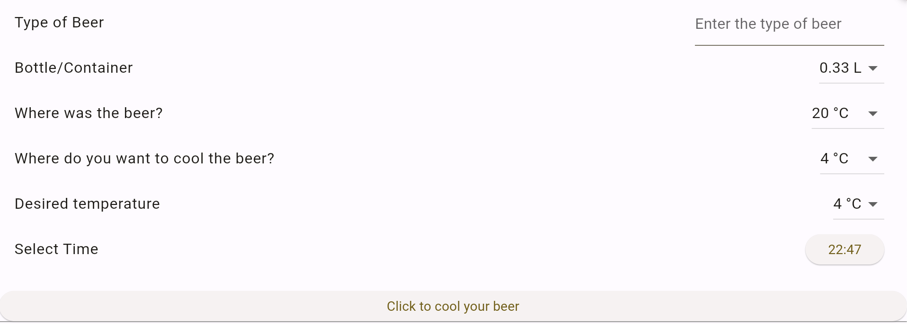
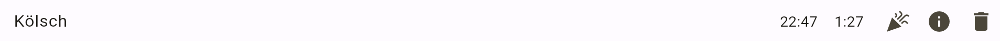
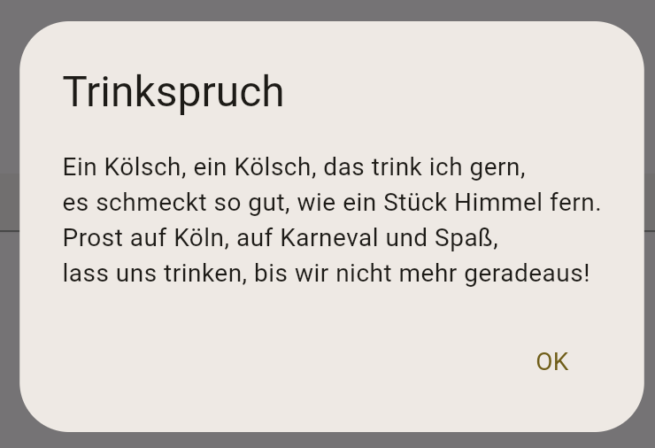
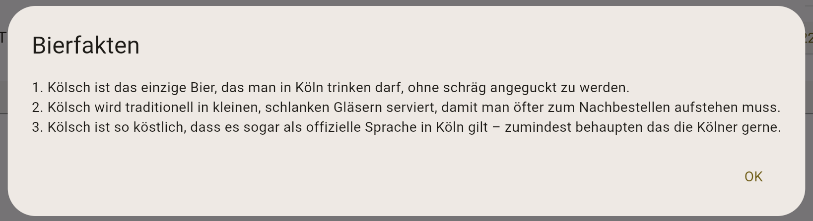

# Projekt Web-Entwicklung

Im Rahmen meines Studiums der Angewandten Informatik an der Fachhochschule der Wirtschaft in Bergisch Gladbach entstand im Modul _Web-Entwicklung_ dieses Projekt. Die Aufgabe bestand darin, die bestehende [Web-App](https://github.com/csoltenborn/web_entwicklung_BFAX422A) individuell zu erweitern.

## Inhaltsverzeichnis

- [Idee](#idee)
- [Ziele und Vorgehensweise](#ziele-und-vorgehensweise)
- [Die Web-App](#die-web-app)
- [Ausblick](#ausblick)


## Idee

Das Projekt "Beer Cooling" entstand aus der Idee, eine Webanwendung zu entwickeln, die es ermöglicht, die Kühlzeit von Bierflaschen basierend auf verschiedenen Parametern zu berechnen. Die Anwendung beantwortet die Frage:

> Wie lange benötigt ein Bier mit einer Flaschengröße A, welches vorab bei B °C gekühlt war, wenn ich es nun bei Temperatur C °C kaltstelle und ich wünsche, dass das Bier eine Termperatur von D °C bekommt?

## Ziele und Vorgehensweise

Das Projekt umfasst mehrere Erweiterungen, darunter die Anpassung der Benutzeroberfläche, die Integration einer Speicherverwaltung und die Erstellung einer Formel zur Berechnung der Kühlzeit. Der Splashscreen dient als Begrüßungsbildschirm und leitet den Benutzer nach einer kurzen Verzögerung zur Hauptseite weiter. Auf der Hauptseite kann der Benutzer die relevanten Informationen eingeben und die berechnete Kühlzeit abrufen. Zudem wurden Funktionen zur Speicherung und zum Laden der Bierinformationen implementiert, um die Eingaben des Benutzers zwischen den Sitzungen zu erhalten.


## Die Web-App

### Main: Initialisierung der App

Der Einstiegspunkt der Anwendung befindet sich in der `main.dart`. Hier wird der API-Client initialisiert und das Haupt-Widget `AiApp` gesetzt, wobei zunächst ein Splashscreen initialisiert wird: 

```dart
home: const SplashScreen(),
```

### Splashscreen

In `splashscreen.dart` wird mit `initState()` der SplashScreen initialisiert und die Navigation zur HomePage wird um 3 Sekunden verzögert:

```dart
Future.delayed(const Duration(seconds: 3), () {
    Navigator.of(context).pushReplacement(
    MaterialPageRoute(builder: (context) => const HomePage(title: 'Beer Cooling')),
    );
});
```

Währenddessen wird die Benutzeroberfläche der Splashscreens mit `build()` gebaut, welche ein Icon anzeigt:

```dart
@override
  Widget build(BuildContext context) {
    return Scaffold(
      body: Center(
        child: Icon(
          Icons.sports_bar,
          size: 100,
          color: Colors.orange.shade300,
        ),
      ),
    );
  }
```

### Homepage: Widgets und Zustandsvariablen

Der HomeScreen ist die Hauptseite der App, auf der Benutzer Informationen über ihr Bier eingeben können, um die Kühlzeit zu berechnen. Er umfasst Eingabefelder für Biertyp, Flaschengröße, aktuelle und gewünschte Temperatur sowie den Startzeitpunkt. 



Zunächst werden die Zustandsvariablen initialisiert, die die Benutzereingaben und Ergebnisse speichern.

```dart
List<BeerInformation> beerList = [];

String selectedTypeOfBeer = '';
double selectedContainer = 0.33;
double selectedWhereWasTheBeer = 20.0;
double selectedWhereToCoolTheBeer = 4.0;
double selectedDesiredTemperature = 4.0;
TimeOfDay selectedStartTime = TimeOfDay.now();
TimeOfDay calculatedCoolingTime = TimeOfDay.now();
```

Ich habe mich für ein vertikales Layout entschieden, das verschiedene Eingabefelder und die Liste der gespeicherten Biere enthält. Dazu wird das vordefiniertes Layout-Widget `ListTile` für Listeneinträge verwendet.

Für die Eingabe des Biertyps verwende ich ein TextField:

```dart
ListTile(
    title: const Text('Type of Beer'),
    trailing: SizedBox(
        width: 200,
        child: TextField(
        decoration: const InputDecoration(
            hintText: 'Enter the type of beer',
        ),
        onChanged: (value) {
            selectedTypeOfBeer = value;
        },
        ),
    ),
),
```
Für die Flaschengröße und Temperaturen verwende ich Dropdown-Menüs. Hier einmal das Dropdown für die Größe der Flasche: 

```dart
ListTile(
    title: const Text('Bottle/Container'),
    trailing: DropdownButton<double>(
        value: selectedContainer,
        items: <double>[
        0.25,
        0.33,
        0.5
        ].map((double value) {
        return DropdownMenuItem<double>(
            value: value,
            child: Text('$value L'),
        );
        }).toList(),
        onChanged: (double? newValue) {
        setState(() {
            selectedContainer = newValue!;
        });
        },
    ),
),    
```

Für Die Auswahl der Zeit verwende ich eine Schaltflächen:

```dart
ListTile(
    title: const Text('Select Time'),
    trailing: ElevatedButton(
        onPressed: () {
        _selectTime(context);
        },
        child: Text('${selectedStartTime!.hour}:${selectedStartTime!.minute}'),
    ),
),
```

Beim Klick auf den Button wird ein Zeitwahldialog angezeigt und die ausgewählte Zeit wird gespeichert, wenn sie sich von der aktuellen Startzeit unterscheidet.

```dart
Future<void> _selectTime(BuildContext context) async {
    final TimeOfDay? pickedTime = await showTimePicker(
        context: context,
        initialTime: TimeOfDay.now(),
    );
    if (pickedTime != null && pickedTime != selectedStartTime) {
        setState(() {
        selectedStartTime = pickedTime;
        });
    }
}
```

Für jedes gespeicherte Bier aus der Liste wird dynamisch ein Widget erstellt.



```dart
Expanded(
    child: ListView.builder(
        itemCount: beerList.length,
        itemBuilder: (BuildContext context, int index) {
        return _buildListRow(context, beerList[index]);
        },
    ),
),
```

Das dynamisch erstelle Widget beinhaltet dann die Sorte des Biers als ein Text-Child, sowie einen Button um einen Trinkspruch zu erhalten, 3 Fakten der Bier-Sorte zu erhalten und einen Button zum Lösches des Bier-Elements: 

```dart
children: [
    Expanded(
        child: ListTile(
            title: Text(beerInfo.typeOfBeer),
            ),
    ),
    Text('${beerInfo.selectedStartTime.hour}:${beerInfo.selectedStartTime.minute}'),
    const SizedBox(width: 16), 
    Text('${beerInfo.calculatedCoolingTime.hour}:${beerInfo.calculatedCoolingTime.minute}'),
    const SizedBox(width: 12), 
    IconButton(
        icon: const Icon(Icons.celebration),
        onPressed: () => _askAI(context, beerInfo, 1),
    ),
    IconButton(
        icon: const Icon(Icons.info),
        onPressed: () => _askAI(context, beerInfo, 2),
    ),
    IconButton(
        icon: const Icon(Icons.delete),
        onPressed: () {
        setState(() {
            beerList.remove(beerInfo);
        });
        saveBeerList(beerList);
        },
    ),
],
```


### Funktionalitäten: Bier

#### Bier-Objekt erstellen

`_setUserInput` erstellt ein BeerInformation-Objekt basierend auf den Benutzereingaben, berechnet die Kühlzeit und fügt das Objekt zur Bierliste hinzu. Anschließend wird die Liste gespeichert. Die Hilfsfunktion `_createBeerInformationObject` wird benötigt, um ein BeerInformation-Objekt mit den aktuellen Zustandswerten zuerstellen. 

```dart
void _setUserInput() {
  BeerInformation beerInformation = _createBeerInformationObject();
  beerInformation.calculatedCoolingTime = calculateCoolingTime(beerInformation);
    
  setState(() {
    beerList.add(beerInformation);
  });

  saveBeerList(beerList);
}

BeerInformation _createBeerInformationObject() {
  return BeerInformation(
    typeOfBeer: selectedTypeOfBeer,
    container: selectedContainer,
    whereWasTheBeer: selectedWhereWasTheBeer,
    whereToCoolTheBeer: selectedWhereToCoolTheBeer,
    desiredTemperature: selectedDesiredTemperature,
    selectedStartTime: selectedStartTime,
    calculatedCoolingTime: calculatedCoolingTime,
  );
}
```

Mithilfe der `calculateCoolingTime()`- Funktion wird dann eine Uhrzeit für die Kühlzeit errechnet, welche dann in die Varaible `calculatedCoolingTime` geschrieben wird.

```dart
TimeOfDay calculateCoolingTime(BeerInformation beerInfo) {
  double initialTemperature = beerInfo.whereWasTheBeer; 
  double finalTemperature = beerInfo.desiredTemperature;

  double temperatureDifference = initialTemperature - finalTemperature;

  double coolingCoefficient;

  switch (beerInfo.whereToCoolTheBeer) {
    case 4.0: 
      coolingCoefficient = 0.01; 
      break;
    case -18.0: 
      coolingCoefficient = 0.02; 
      break;
    default:
      coolingCoefficient = 0.005; 
  }

  double coolingTimeMinutes = temperatureDifference / coolingCoefficient;

  int coolingHours = (coolingTimeMinutes / 60).floor();
  int coolingMinutes = (coolingTimeMinutes % 60).round();

  int endHour = (beerInfo.selectedStartTime.hour + coolingHours + (beerInfo.selectedStartTime.minute + coolingMinutes) ~/ 60) % 24;
  int endMinute = (beerInfo.selectedStartTime.minute + coolingMinutes) % 60;

  return TimeOfDay(hour: endHour, minute: endMinute);
}
```

#### Trinkspruch und Bier-Fakten

Beim Klick auf den Trinkspruch-Button bzw. den Bier-Fakten-Button wird die `_askAI` Funktion aufgerufen. Dabei wird einmal das entsprechende Bier-Objekt übergeben und zum Anderen ein Integer-Wert:
- `1`: Trinkspruch-Button
- `2`: Bier-Fakten-Button





Basierend auf dem Integer-Wert wird ChatGPT entweder nach einem Trinkspruch oder nach 3 Bier-Fakten gefragt:

`_askAI()`:

```dart
if (iconbutton == 1) {
    messageText = "Gib einen witzigen Trinkspruch für das folgende Bier: ${beerInfo.typeOfBeer}";
} else if (iconbutton == 2) {
    messageText = "Gib mir 3 witzige, kurze, knackige Fakten über die Biersorte: ${beerInfo.typeOfBeer}";
} else {
    messageText = "Unbekannte Anfragequelle.";
} 
```

`_showResponseDialog()` zeigt einen Dialog mit der Antwort der Chat-API an. Der Titel des Dialogs hängt von der ausgewählten Option ab.

```dart
showDialog(
    context: context,
    builder: (BuildContext context) {
    return AlertDialog(
        title: Text(dialogTile),
        content: Text(response),
        actions: <Widget>[
        TextButton(
            child: const Text('OK'),
            onPressed: () {
                Navigator.of(context).pop();
            },
        ),
        ],
    );
    },
);
```

### Storage

Das _shared_preferences_ Plugin für Flutter ermöglicht das einfache Speichern und Abrufen von einfachen Daten wie Strings, Zahlen und Listen von Strings in einem persistenten Speicher. Dies ist besonders nützlich für das Speichern von Benutzereinstellungen und kleinen Datenmengen zwischen den Sitzungen einer App.

Die `storage_helper.dart` Datei enthält Funktionen zum Speichern und Laden der Liste von Bierinformationen (BeerInformation). Diese Funktionen nutzen das shared_preferences Plugin, um die Daten im lokalen Speicher zu persistieren.

#### Laden der Bier-Liste bei App-Initialisierung

In der `homepage.dart` wird beim Initialisieren des Widgets `initState` aufgerufen, um die Bierliste zu laden und `_loadBeerList` lädt die gespeicherte Bierliste aus dem lokalen Speicher:

```dart
@override
void initState() {
  super.initState();
  _loadBeerList();
}
```

#### Laden der Bier-Liste

Die Funktion `loadBeerList` ist eine asynchrone Methode, die eine Liste von BeerInformation-Objekten lädt. Zuerst wird eine Instanz von SharedPreferences abgerufen. Dann wird die gespeicherte Liste von JSON-Strings aus dem lokalen Speicher abgerufen. Wenn die Liste existiert, wird jeder JSON-String zurück in ein BeerInformation-Objekt umgewandelt, um eine Liste von BeerInformation-Objekten zu erstellen. Wenn keine Daten gefunden werden, wird eine leere Liste zurückgegeben.

```dart
Future<List<BeerInformation>> loadBeerList() async {
  final prefs = await SharedPreferences.getInstance();
  List<String>? beerListJson = prefs.getStringList('beerList');
  if (beerListJson != null) {
    return beerListJson
        .map((beerJson) => BeerInformation.fromJson(jsonDecode(beerJson)))
        .toList();
  } else {
    return [];
  }
}
```

#### Sichern der Bier-Liste


Die Funktion `saveBeerList` ist eine asynchrone Methode, die eine Liste von BeerInformation-Objekten speichert. Zuerst wird eine Instanz von SharedPreferences abgerufen. Dann wird jede BeerInformation-Instanz in einen JSON-String umgewandelt und in eine Liste von Strings eingefügt. Schließlich wird diese Liste von JSON-Strings im lokalen Speicher unter dem Schlüssel 'beerList' gespeichert.

```dart
Future<void> saveBeerList(List<BeerInformation> beerList) async {
  final prefs = await SharedPreferences.getInstance();
  List<String> beerListJson = beerList.map((beer) => jsonEncode(beer.toJson())).toList();
  await prefs.setStringList('beerList', beerListJson);
}
```

## Ausblick

Aktuell gibt es jedoch noch ein Issue bei der Berechnung der Kühlzeit, das behoben werden muss. In zukünftigen Versionen der Anwendung ist geplant, dieses Issue zu lösen und die Funktionalität weiter zu erweitern. Eine interessante Erweiterung wäre beispielsweise die Implementierung einer Wein-Kühlzeitberechnung, um die Anwendung auch für Weinliebhaber attraktiv zu machen.
